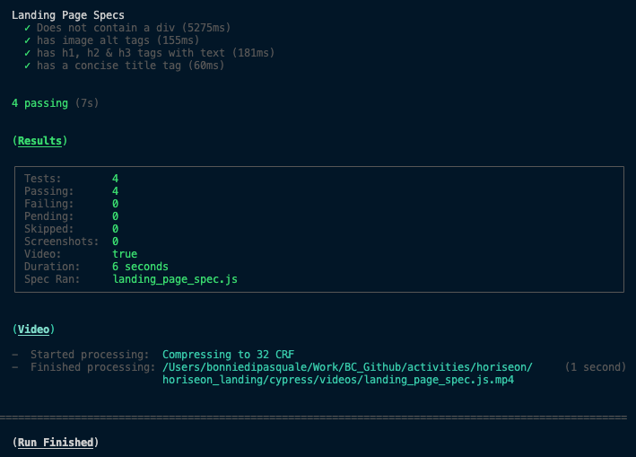
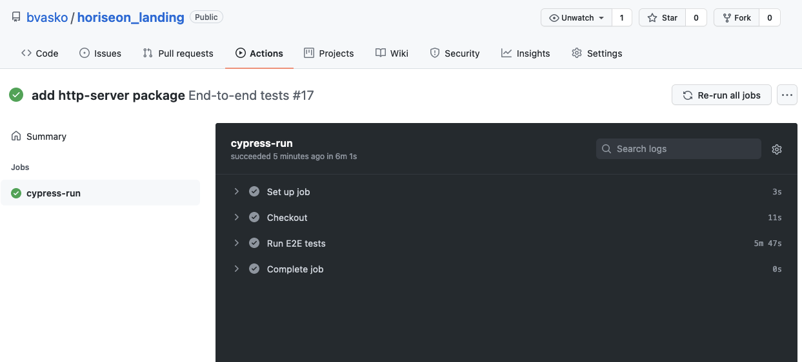
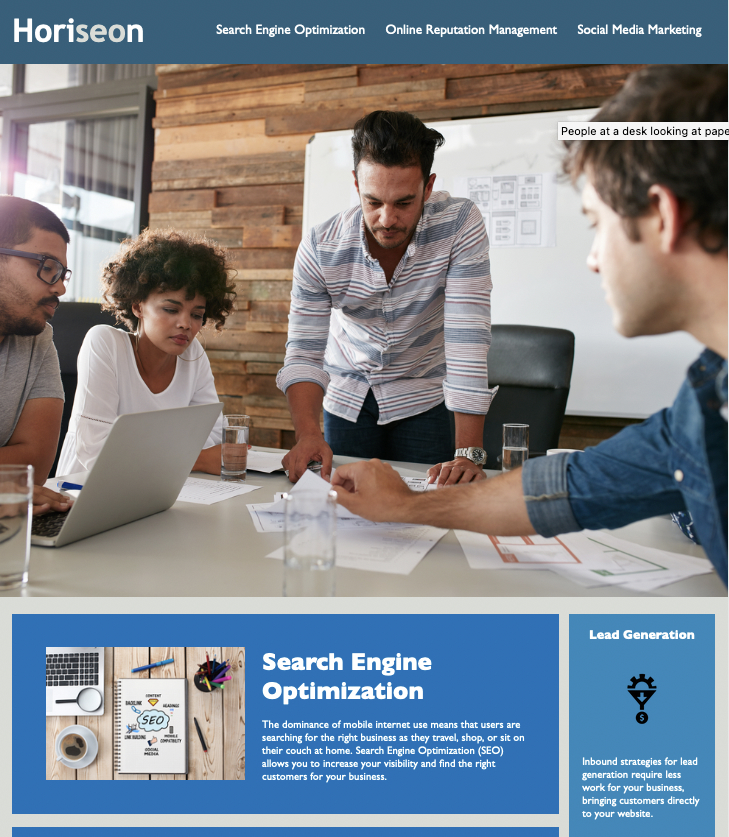

# Horiseon Landing Page

## Scope of Work
 - Take the provided HTML & CSS and convert the page to semantic HTML while ensuring the CSS properties are still properly applied
 - Ensure the page meets web accessibility standards

### Changes
- all divs converted to the appropriate semantic html tag
- alt tags added to images
- title tags added where appropriate
- add tabindex=0 to enable page navigation with the keyboard

### Run Integration Tests Locally
Integration tests ensure that the code continues to meet the accessibility standards outlined in the Scope of Work document.
You can run the integration tests by running the following commands
```
npm init
npm run e2e
```
A vidoe of the test run is captured and output to the cypress/videos directory

Test results will output in the terminal 


### CI test run
- The .github/workflows folder contains the github actions setup file
- Cypress integration tests will run everytime code is pushed or merged

## Landing Page Screenshot

